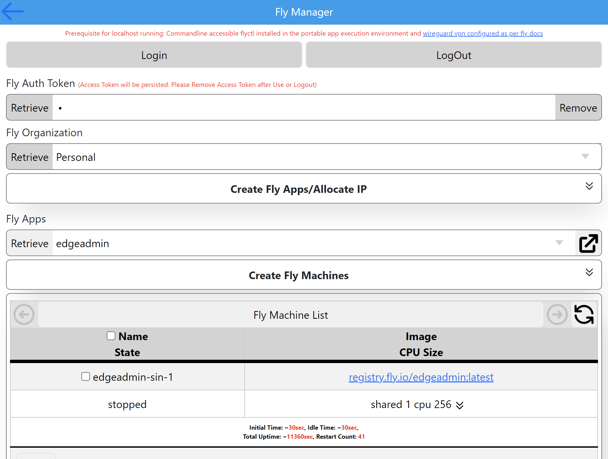

# Fly Manager

Implementaion of Portable Fly Manager for managing <a href="https://fly.io">fly.io</a> machines to run in servers, desktops and mobile.

Demo Hosted version is in <a href="https://edgeadmin.fly.dev">https://edgeadmin.fly.dev</a> (Will be periodically reinstalled and hence loose the Login Credentials)

Docker Image is <a href="https://hub.docker.com/r/arshucs/edgeapp">arshucs/edgeapp</a>

Source of the Web UI is in the current repository under wwwroot folder.

 "Portable Machine Manager for Managing Fly Machines".

# Getting Started

### Clone the Repository and Run the Portal Machine Manager in the Desktop

### Ensure that FlyCtl is installed and Wireguard Connection is Setup for the Fly User.

### Deploy docker image arshucs/edgeapp into Fly and Login

### Modify the UI in the wwwroot folder and copy to the respective linux64 directory and deploy to fly
